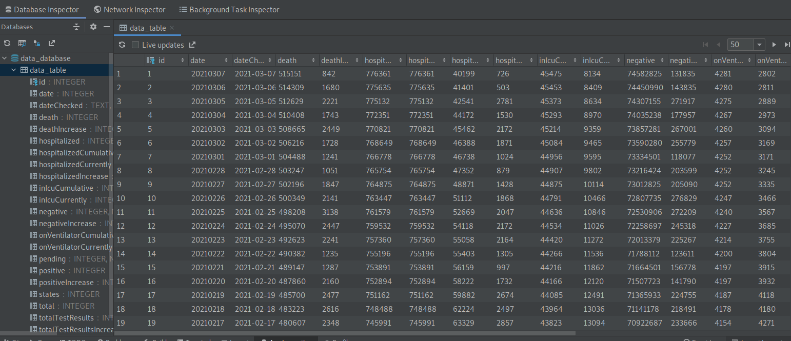
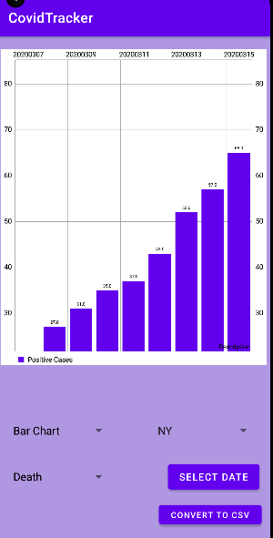
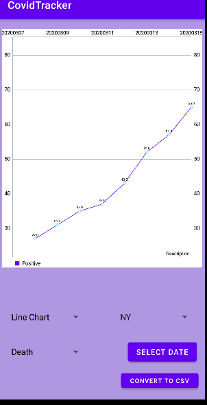

# CovidTrackerEmonics
# CovidTrackerEmonics


  -Retrofit
  -Activity
  -FireBase
  -Room Datase
  -SQL syntax
  -Kotlin
  -Courutines
  


## Table of Contents
1. [General Info](#general-info)
2. [Technologies](#technologies)
3. [Installation](#installation)
4. [Collaboration](#collaboration)
5. [FAQs](#faqs)
### General Info
***

Data Visualization project.
Fetches data using RetroFit and stores in a Room Database.
ModelView is used to create the retrofit data.
FireBase is used to authenticate users.
The data involves deaths, negative, positive test results, Queries are perform based on date ranges and state selected. 
The queried data can be graphed in xy plane with lines connecting them or they can be put in a bar graph. 
The data is fetched from https://api.covidtracking.com/ where a Json is captured and parse Using Retrofit. 


### RoomDataBase

This is our Database table with data populated. This was viewed using App Inspector. 


## Technologies
***
A list of technologies used within the project:
* [MP Android Chart](https://com.github.PhilJay:MPAndroidChart): Version 2.2.4 
* [View Model](https://androidx.lifecycle:lifecycle-viewmodel-ktx): Version 2.5.1
* [Room](https://androidx.room): Version 2.3
* [RetroFit](https://com.squareup.retrofit2:retrofit):Version 2.7.1 

## Demo
***
#Splash Screen


#LoginSingUpScreen


#Data Visualization





Side information: To use the application in a special environment use ```lorem ipsum``` to start
## Collaboration
***
Give instructions on how to collaborate with your project.
> Maybe you want to write a quote in this part. 
> Should it encompass several lines?
> This is how you do it.
## FAQs
***
A list of frequently asked questions
1. **This is a question in bold**
Answer to the first question with _italic words_. 
2. __Second question in bold__ 
To answer this question, we use an unordered list:
* First point
* Second Point
* Third point
3. **Third question in bold**
Answer to the third question with *italic words*.
4. **Fourth question in bold**
| Headline 1 in the tablehead | Headline 2 in the tablehead | Headline 3 in the tablehead |
|:--------------|:-------------:|--------------:|
| text-align left | text-align center | text-align right |
